English | [繁體中文](README_TCH.md)

# How-to-install-controlNet
A respository help you install controlNet

# Stable Diffusion Webui
首先，在開始使用 controlNet 之前，我會推薦您，請先安裝 Stable Diffusion Webui 。 這可以讓後續的步驟和應用上都更加輕鬆。

如果安裝 Stable Diffusion Webui 有困難，可以參考 [Lets-start-install-stable-diffusion](https://github.com/JingShing/Lets-start-install-stable-diffusion/blob/main/README.md)。

# controlNet

需要安裝：
* sd-webui-controlnet
* openpose-editor

以上所需的插件在最新版本的 Stable Diffusion Webui 已經可以透過 GUI 的操作來安裝。

請先進入 extension 中，點選 Available 並點擊 Load from 按鈕，從網站上取得插件列表。如下圖。

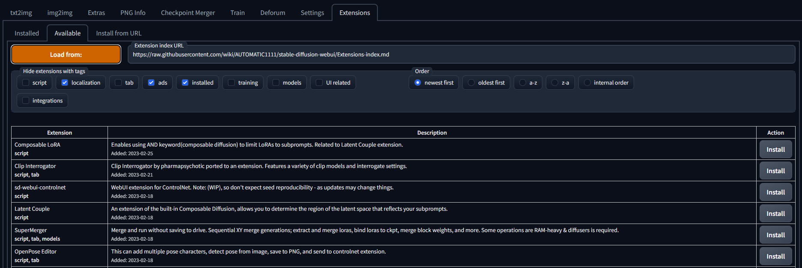

找到
* sd-webui-controlnet
* openpose-editor

點選 install。

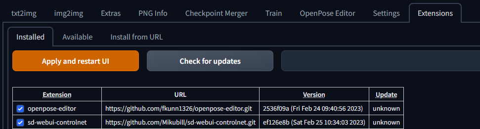

安裝完後，請到 installed 的區域，查看是否安裝成功。(如果沒有顯示可以點選 reload 將頁面重整)。

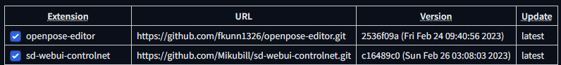

記得點選 check for updates 查看是否是最新版本。(如若不是最新版本，可以在查看後點選 apply 來安裝最新版，記得安裝完後要 reload)

---
# OpenPose Editor
安裝成功的話，就可以看到選單多了一個 OpenPose Editor 。(如果有成功 installed ，但沒有出現此選單，可以考慮 reload 或 重啟 Stable Diffusion Webui)

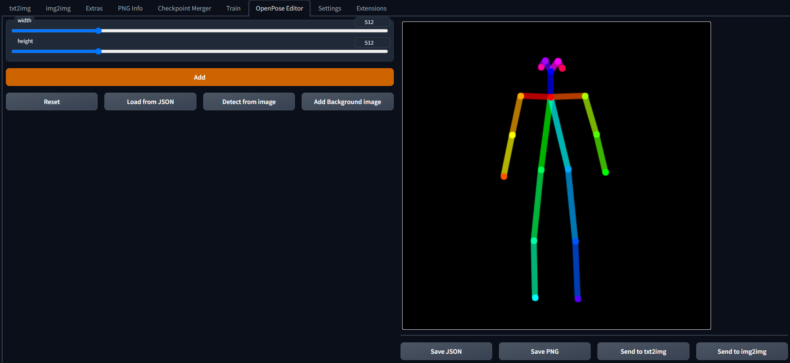

可以點選 Detect from image 使用圖片來讀取姿勢，亦或是使用手動的方式調整火柴人的姿勢。(detect 時，記得將解析度/比例調整正確，否則辨識的結果可能不會很理想)

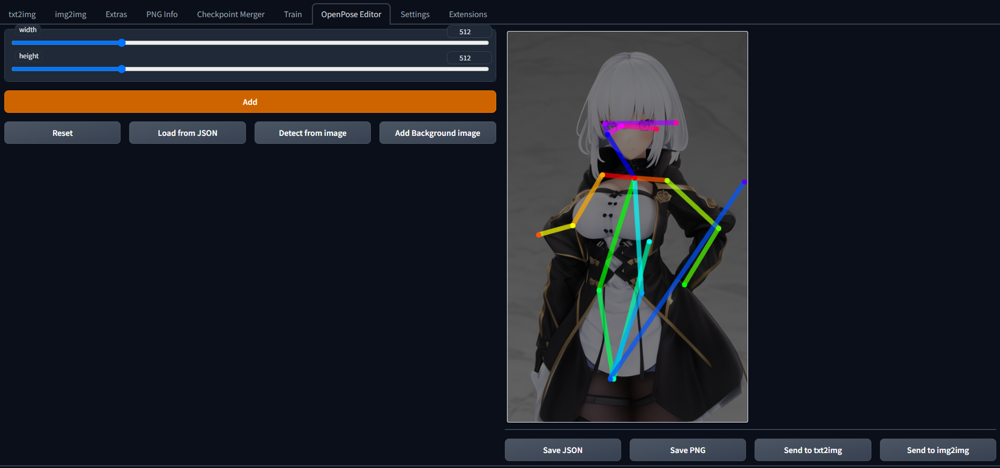

這個是自動辨識的結果，並不是特別準確，需要自己手動調整。

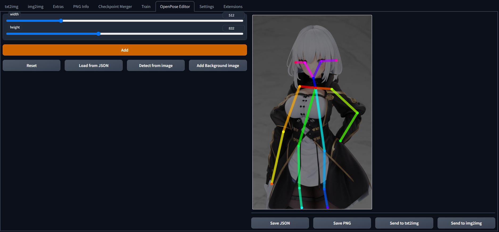
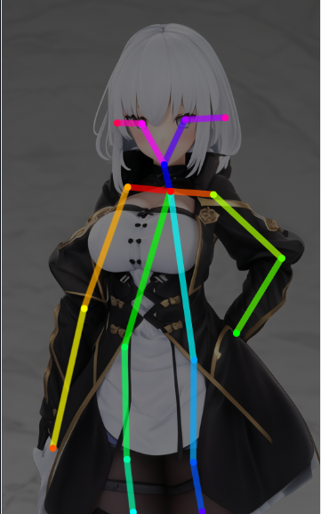

手動調整過後。(頭的部分，內兩點是眼睛，外兩點是耳朵)

可以選擇將調整過後的火柴人送到 txt2img(以字生圖) 或 img2img(以圖生圖) 中做為參考。以下將以 txt2img 作為範例。

---
# ControlNet in txt2img
延續上面，將調整過後的火柴人送到 txt2img，可以看到 txt2img 底下多出了一個 controlNet 的區塊。

使用此區塊需要[下載 controlNet 特製的模型](https://huggingface.co/webui/ControlNet-modules-safetensors/blob/main/control_openpose-fp16.safetensors)，下載完後，放入 Stable diffusion Webui 安裝資料夾底下：

```stable-diffusion-webui\extensions\sd-webui-controlnet\models```

如果 ControlNet 區塊的 model 沒有讀取到模型的話，建議 reload 或是重啟 Stable diffusion Webui。

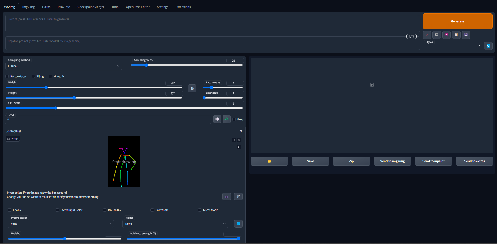

底下有不同的選下可以勾選，記得要勾選 enable 才會使用 controlNet 的姿勢做為參考。如果顯存不足也可以開啟 low-vram 來減輕顯卡負擔。

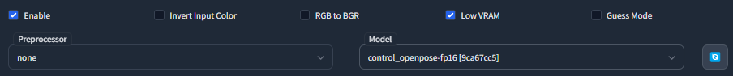

填入關鍵詞後，調整好參數，就可以生成圖片了。輸出的圖片會附上先前調整的 openpose 的圖片，記得保存可以用於下次使用。

輸出的圖片和先前調整的姿勢：

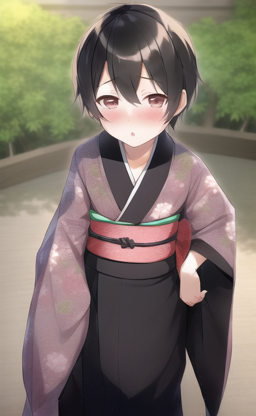
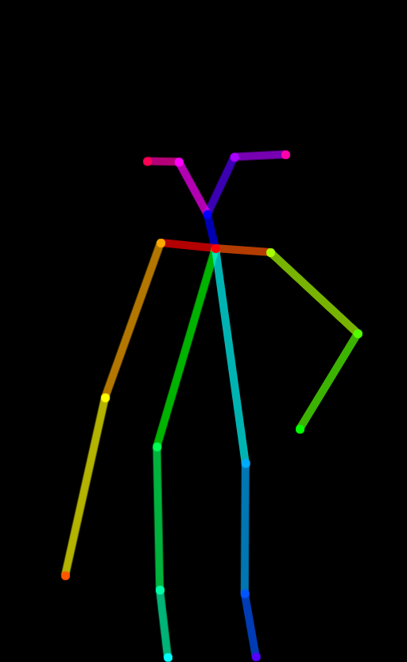
