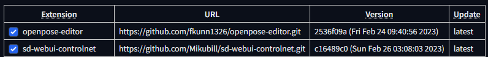

[English](README.md) | 繁體中文

# 如何安裝 controlNet
一篇協助安裝 controlNet 的文檔

# Stable Diffusion Webui
首先，在開始使用 controlNet 之前，我會推薦您，請先安裝 Stable Diffusion Webui 。 這可以讓後續的步驟和應用上都更加輕鬆。

如果安裝 Stable Diffusion Webui 有困難，可以參考 [讓我們一起安裝 stable-diffusion](https://github.com/JingShing/Lets-start-install-stable-diffusion/blob/main/README.md)。

# controlNet

需要安裝：
* sd-webui-controlnet
* openpose-editor

以上所需的插件在最新版本的 Stable Diffusion Webui 已經可以透過 GUI 的操作來安裝。

請先進入 extension 中，點選 Available 並點擊 Load from 按鈕，從網站上取得插件列表。如下圖。

找到
* sd-webui-controlnet
* openpose-editor

點選 install。

安裝完後，請到 installed 的區域，查看是否安裝成功。(如果沒有顯示可以點選 reload 將頁面重整)。

記得點選 check for updates 查看是否是最新版本。(如若不是最新版本，可以在查看後點選 apply 來安裝最新版，記得安裝完後要 reload)

